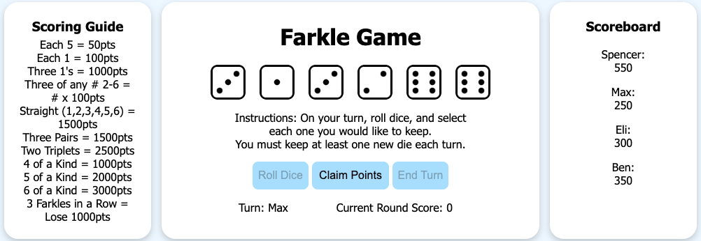

# 🎲 Farkle Dice Game

A simple browser-based implementation of the classic dice game **Farkle**, built with **HTML, CSS, and JavaScript**.  
This version supports a **local multiplayer** mode (2–4 players).

---

## Live Demo
[Play on GitHub Pages](https://spencernemy.github.io/farkle-dice-game/)

---

## Features
- **Multiplayer Gameplay** (2–4 players on the same computer)  
- Interactive dice rolling with scoring logic  
- Farkle detection and handling  
- Accurate point calculation based on standard Farkle rules  
- Clean modular JavaScript structure:
  - `state.js` — Game state management  
  - `scoring.js` — All scoring logic  
  - `uiHelpers.js` — Display messages and UI helpers  
  - `game.js` — Main gameplay logic and event handling
  - `main.js` - Provides entry point for program

---

## How It Works

- Each turn, players roll six dice.
- Players can select dice to keep and claim points based on combinations.
- Rolling no valid scoring dice results in a Farkle, ending the turn with no points.
- After each turn, the game automatically switches to the next player.
- Consecutive Farkles per player are tracked individually.

---

## 📸 Preview

